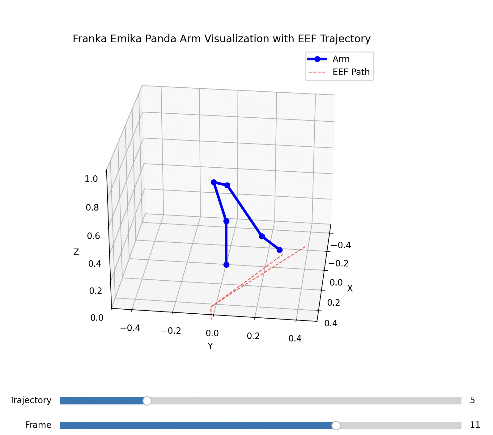

# Franka Emika Panda Arm Visualization

3D visualization of the Franka Emika Panda robot arm with trajectory playback using Denavit-Hartenberg (DH) parameters.



## Features

- Interactive slider controls for trajectory navigation
- End-effector path visualization
- Forward kinematics implementation

## Requirements

- Python 3.8+
- NumPy
- Matplotlib

## Installation

1. Clone this repository.
2. Install dependencies:
    ```bash
    pip install -r requirements.txt
    ```

## Usage

```bash
python franka_visualization.py
```
- Use the sliders to control trajectory playback.

## Data Format

Trajectories are read from `trajectories.csv` with the following structure:

| Timestamp | Joint 1 | Joint 2 | ... | Joint 7 | X | Y | Z | roll | pitch | yaw |
|-----------|---------|---------|-----|---------|---|---|---|------|-------|-----|

- **Joint angles:** In radians (columns 2-8).
- **End-effector position:** X, Y, Z coordinates (columns 9-11).
- **End-effector orientation:** Roll, pitch, yaw (columns 12-14, not used in simulation).

### File Structure

- First row contains column headers.
- Each trajectory is a set of rows; different trajectories are separated by empty rows.

**Example:**

```csv
<empty row here to separate trajectories>
Timestamp,Joint 1,Joint 2,Joint 3,Joint 4,Joint 5,Joint 6,Joint 7,X,Y,Z,roll,pitch,yaw
0.0,0.1,0.2,0.3,0.4,0.5,0.6,0.7,0.5,-0.2,0.3,0.1,0.0,0.0
0.1,0.12,0.22,0.32,0.42,0.52,0.62,0.72,0.51,-0.21,0.31,0.11,0.01,0.02
<empty row here to separate trajectories>
0.0,0.2,0.3,0.4,0.5,0.6,0.7,0.8,0.4,-0.1,0.2,0.0,0.1,0.0
0.1,0.22,0.32,0.42,0.52,0.62,0.72,0.82,0.41,-0.11,0.21,0.01,0.11,0.02
